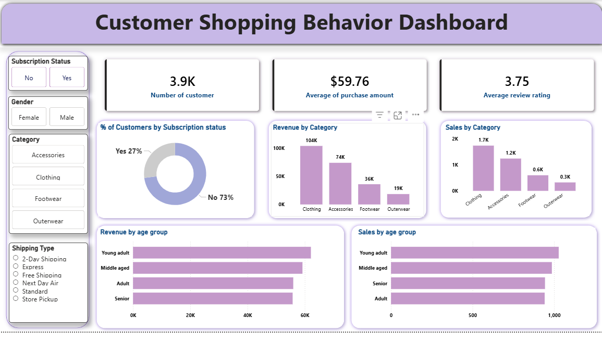

## 📊 Data-Driven Customer Segmentation & Revenue Analysis

## 🚀 Project Overview
This project presents an end-to-end data analytics solution focused on understanding customer shopping behavior and optimizing revenue strategies. By analyzing transactional data, it uncovers actionable insights into customer segments, purchasing patterns, and product performance.

The workflow integrates Python (Pandas) for data cleaning & preprocessing, SQL (MySQL) for analysis, and Power BI for visualization—delivering a complete business intelligence solution.

## 🎯 Business Objective
Organizations often struggle to:

-Identify high-value customers
-Improve customer retention
-Optimize discount and pricing strategies

This project addresses these challenges through data-driven insights and strategic recommendations.

## 🛠️ Tech Stack
-Python (Pandas) – Data cleaning & preprocessing
-SQL (MySQL) – Data querying and analysis
-Power BI – Dashboard creation and visualization

## 📁 Dataset Details
-Total Records: 3,900+ transactions
-Features: 18 columns

Includes:
-Customer demographics (Age, Gender, Location)
-Purchase details (Category, Amount, Season, Size, Color)
-Behavioral data (Discount usage, Frequency, Reviews, Shipping type)

## 🔍 Key Analysis Performed
-Customer segmentation (Returning vs Loyal customers)
-Revenue analysis by gender, age group, and product categories
-Impact of discounts on customer spending behavior
-Subscription vs non-subscription revenue comparison
Identification of top-performing products

## 📊 Dashboard Preview

📈 Dashboard Highlights
📌 KPIs: Total Customers, Average Purchase Value, Review Rating
📊 Revenue & Sales by Category
👥 Customer Segmentation Insights
🎯 Subscription Behavior Analysis
🎂 Revenue by Age Group
🎛️ Interactive filters (Gender, Category, Shipping Type)

## 💡 Key Insights
-Female customers contribute the highest share of revenue
-Repeat buyers show strong potential for subscription conversion
-Clothing category is the top revenue generator
-Discounts increase sales volume but require optimization for profitability

## 🎯 Business Recommendations
-Target high-value customers with personalized marketing to maximize revenue and retention
-Optimize discount strategies to balance sales growth and profit margins
-Convert repeat buyers into subscribers through exclusive incentives
-Promote top-rated and best-selling products to increase conversions

## 🚀 Future Scope
-Customer churn prediction
-Personalized recommendation system
-Advanced customer segmentation (RFM analysis)

## 📊 Dashboard Preview

